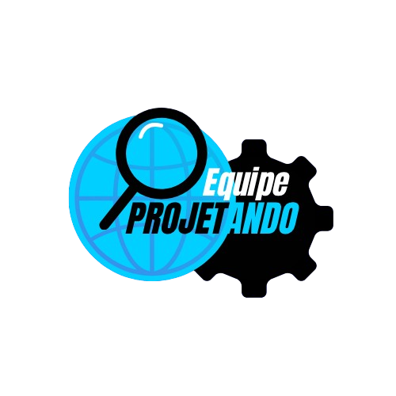

  

<h4>
  Sumário: 
 <a href="#sobre">Sobre</a> • 
 <a href="#equipe">Equipe</a> • 
 <a href="#cliente">Cliente</a> • 
 <a href="#ferramentas">Ferramentas</a> • 
</h4>

## Sobre

Olá, Este projeto está sendo desenvolvido para atender às necessidades do Instituto Vorp, uma instituição voltada para ações sociais. Vamos desenvolver um sistema digital acessível ao público, que permita cadastrar doações, doadores, beneficiários e instituições atendidas, além de consultar relatórios e histórico de ações.
O sistema visa organizar e centralizar informações, facilitar o engajamento de novos doadores e aumentar a transparência e eficiência das operações do Instituto.
A realização deste projeto é ligada diretamente a Universidade Federal do Ceará-UFC na disciplina de PROJETO INTEGRADO I do curso de Sistemas e Mídias Digitais.

##  Membros da Equipe
|  NOME                           |  FUNÇÃO                    |
|  ----------------------------   |  --------------------------|
|  Ana Luiza                      | Gestor de projeto e atendimento ao cliente   | 
|  Pedro Manoel                   | Desenvolvedor Front-end                      |
|  Emanuel Silva                  | Desenvolvedor Back-end                        |
|  Alidja Dafny                       | Designer de Experiência (UX/UI)             |
|  Maria Letícia                  | QA / Testes e Documentação                   |

## Cliente
 

  

 O Instituto Vorp,
é uma organização sem fins lucrativos que atua apoiando projetos sociais e promovendo ações solidárias em comunidades vulneráveis. Suas atividades envolvem arrecadação e distribuição de roupas, brinquedos, limentos e itens de higiene, além de parcerias com outras iniciativas sociais. 
Atualmente, o controle das doações e atendimentos é feito de forma manual, utilizando planilhas e registros físicos, o que dificulta o acompanhamento das ações e a transparência com os doadores.

## Ferramentas do projeto

