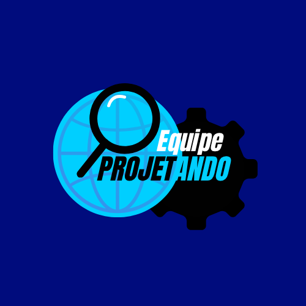

<div align="center" name="inicio">
  <a href="*"></a>
</div>
<h4>
  Sumário: 
 <a href="#sobre">Sobre</a> • 
 <a href="#equipe">Equipe</a> • 
 <a href="#cliente">Cliente</a> • 
<a href="#requisitos">Requisitos</a> •
<a href="#instalacao">Instalação</a> •
<a href="#estrutura">Estrutura</a>
</h4>

<a name="sobre"></a>
## Sobre

Olá, Este projeto está sendo desenvolvido para atender às necessidades do Instituto Vorp, uma instituição voltada para ações sociais. Vamos desenvolver um sistema digital acessível ao público, que permita cadastrar doações, doadores, beneficiários e instituições atendidas, além de consultar relatórios e histórico de ações.
O sistema visa organizar e centralizar informações, facilitar o engajamento de novos doadores e aumentar a transparência e eficiência das operações do Instituto.
A realização deste projeto é ligada diretamente a Universidade Federal do Ceará-UFC na disciplina de PROJETO INTEGRADO I do curso de Sistemas e Mídias Digitais.


<a name="equipe"></a>
##  Membros da Equipe
|  NOME                           |  FUNÇÃO                    |
|  ----------------------------   |  --------------------------|
|  Ana Luiza                      | Gestor de projeto e atendimento ao cliente   | 
|  Pedro Manoel                   | Desenvolvedor Front-end                      |
|  Emanuel Silva                  | Desenvolvedor Back-end                        |
|  Alidja Dafny                       | Designer de Experiência (UX/UI)             |
|  Maria Letícia                  | QA / Testes e Documentação                   |

<a name="cliente"></a>
## Cliente
 <div align="center" name="inicio">
  <a href="*"></a>
</div>
 O Instituto Vorp,
é uma organização sem fins lucrativos que atua apoiando projetos sociais e promovendo ações solidárias em comunidades vulneráveis. Suas atividades envolvem arrecadação e distribuição de roupas, brinquedos, limentos e itens de higiene, além de parcerias com outras iniciativas sociais. 
Atualmente, o controle das doações e atendimentos é feito de forma manual, utilizando planilhas e registros físicos, o que dificulta o acompanhamento das ações e a transparência com os doadores.

<a name="requisitos"></a>
## Requisitos Funcionais, Não Funcionais e de Negócios
| Código | Funcionalidade | Situação |
|------|---------------|----------|
| RF01 | Permitir a visualização pública das ações realizadas pelo Instituto Vorp |  Concluído |
| RF02 | Exibir dados das ações e eventos sociais promovidos pelo Instituto |  Concluído |
| RF03 | Exibir o total de doações recebidas |  Concluído |
| RF04 | Apresentar uma imagem ilustrativa (print) do dashboard com link de acesso externo ao painel interativo |  Concluído |
| RF05 | Permitir filtragem das informações no dashboard por período, tipo de doação e destino |  Pendente |
| RF06 | Disponibilizar formulário online para cadastro de voluntários |  Concluído |
| RF07 | Coletar nome, e-mail, telefone e disponibilidade no formulário de voluntariado |  Planejado |
| RF08 | Exibir página com instruções de como realizar doações |  Concluído |
| RF09 | Garantir acesso administrativo ao coordenador para atualizar fotos e dados |  Concluído |
| RF10 | Permitir o cadastro de novos usuários |  Concluído |
| RF11 | Exibir no dashboard o total recebido por cada tipo de doação |  Concluído |
| RF12 | Página institucional explicando o projeto |  Concluído |

<a name="instalacao"></a>
## 🚀 Instalação e Execução

Para rodar o projeto localmente, siga os passos abaixo:

1.  **Pré-requisitos**: Certifique-se de ter o [Node.js](https://nodejs.org/) instalado em sua máquina.

2.  **Instalação das dependências**:
    Abra o terminal na pasta raiz do projeto e navegue até a pasta do código fonte:
    ```bash
    cd vite-project
    npm install
    ```

3.  **Rodando o projeto**:
    Ainda no terminal, execute o comando para iniciar o servidor de desenvolvimento:
    ```bash
    npm run dev
    ```
    O projeto estará rodando no endereço indicado no terminal (geralmente `http://localhost:5173`).

<a name="estrutura"></a>
## 📂 Estrutura e Rotas

O projeto foi desenvolvido utilizando **React** com **Vite**. A estrutura de pastas está organizada da seguinte maneira:

- **src/components**: Componentes reutilizáveis como Navbar e Footer.
- **src/pages**: As páginas principais da aplicação.
- **src/assets**: Imagens e arquivos estáticos.

### Rotas da Aplicação

As rotas estão configuradas no arquivo `App.jsx` utilizando `react-router-dom`:

- **`/`**: Página Inicial (Home) - Apresentação do instituto.
- **`/login`**: Página de Login - Acesso restrito.
- **`/voluntario`**: Página de Cadastro de Voluntários.
- **`/donate`**: Página de Doações.


